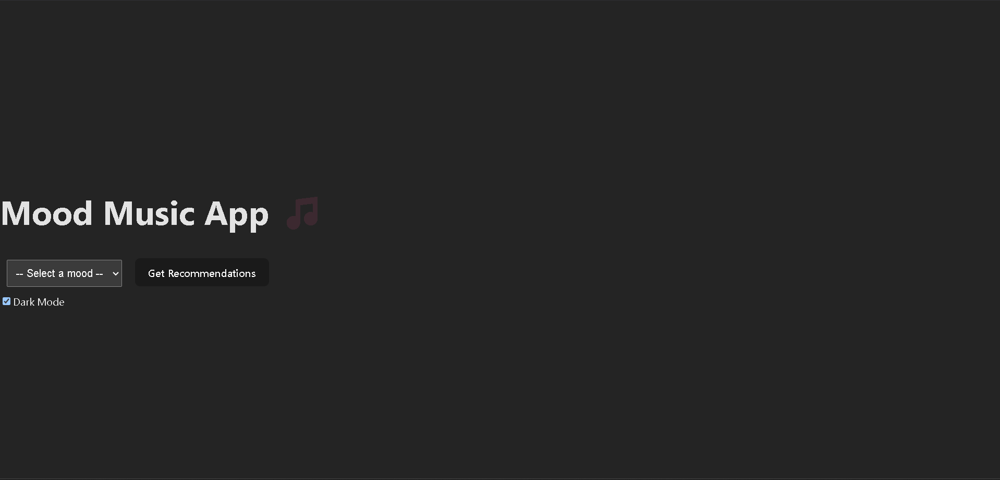

<<<<<<< HEAD

=======
# 🎧 Mood Music App

A full-stack web application that recommends songs based on the user's mood using the Spotify API. Built with React, Node.js, Express, and MySQL.

## 🔥 Live Demo

[Live Site Link](#) *(Coming Soon)*

## 📸 Preview


## 🧠 Features

- 🎵 Get Spotify song recommendations based on selected mood.
- 🌙 Dark mode toggle.
- 📋 Stores and retrieves mood selections via MySQL.
- 💬 Clean and animated UI with React + Tailwind CSS.

## 🛠️ Tech Stack

**Frontend:**
- React
- Vite
- Tailwind CSS
- Axios

**Backend:**
- Node.js
- Express.js
- Spotify Web API (OAuth 2.0)
- MySQL

**Database:**
- MySQL with mood logging

## 🚀 Getting Started

### 1. Clone the repo

```bash
git clone https://github.com/Suhrid-Dutta/mood-music-app.git
cd mood-music-app

## 📬 Contact

Suhrid Dutta – [LinkedIn](https:https://www.linkedin.com/in/suhrid-dutta-530830206)  
Project Link – [https://github.com/Suhrid-Dutta/mood-music-app](https://github.com/Suhrid-Dutta/mood-music-app)
>>>>>>> 30760cef7b935f56ba418f7ca2ebd9c54be63f90
